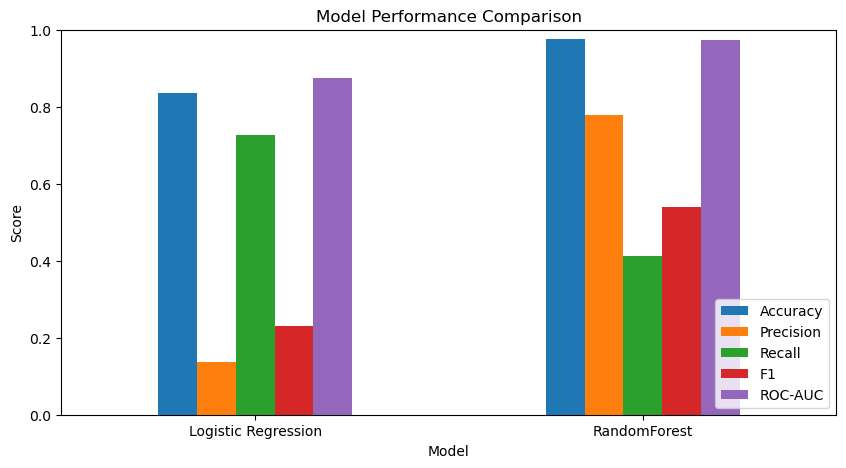
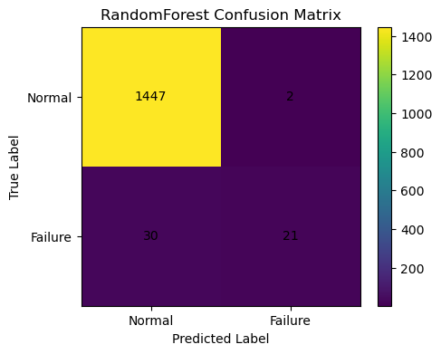
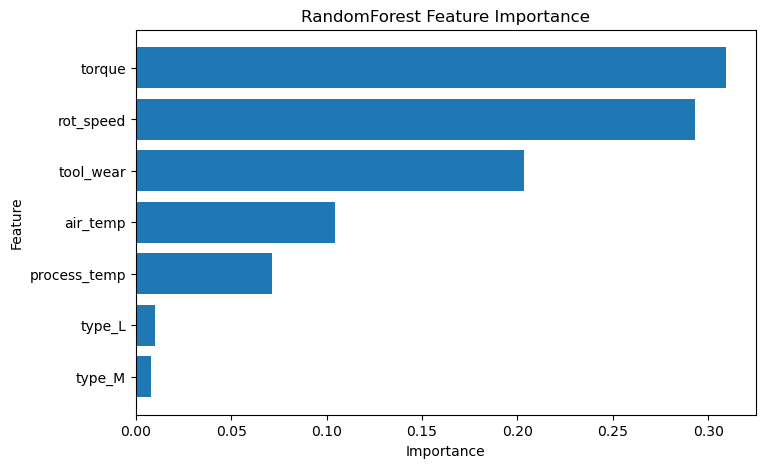

# Manufacturing Machine Learning Project

## 1. 프로젝트 개요

이 프로젝트는 정형 제조 데이터를 기반으로 설비의 고장 여부를 예측하는 머신러닝 프로젝트입니다.

Phase 1에서는 AI4I 2020 Predictive Maintenance Dataset을 활용하여 제조 데이터에 대한 EDA를 수행하였고,
Phase 2에서는 동일한 데이터를 기반으로 정상/고장 여부를 예측하는 이진분류 모델을 구축하였습니다.

본 프로젝트의 최종 목표는 제조 설비의 센서 데이터를 활용하여 고장 가능성을 사전에 예측하고,
고장 예측에 중요한 영향을 미치는 주요 feature를 분석하는 것입니다.

---

## 2. 사용 데이터

* Dataset: AI4I 2020 Predictive Maintenance Dataset
* Task: Binary Classification
* Target: `Machine failure`

Target 값의 의미는 다음과 같습니다.

|  값 | 의미 |
| -: | -- |
|  0 | 정상 |
|  1 | 고장 |

---

## 3. 프로젝트 구조

```text
manufacturing_macine_learning_project/
├── data/
├── notebooks/
│   └── quality_prediction_model.ipynb
├── models/
├── reports/
│   ├── feature_columns.csv
│   └── final_model_test_result.csv
├── figures/
│   ├── failure_label_distribution.png
│   ├── model_performance_comparison.png
│   ├── confusion_matrix_randomforest.png
│   └── feature_importance_randomforest.png
├── README.md
└── .gitignore
```

`data/` 폴더의 원본 CSV 파일과 `models/` 폴더의 `.pkl` 모델 파일은 `.gitignore` 설정에 따라 GitHub에는 업로드하지 않습니다.

---

## 4. 분석 및 모델링 과정

전체 모델링 과정은 다음 순서로 진행하였습니다.

1. 데이터 불러오기
2. 데이터 구조 확인
3. 컬럼명 정리
4. 이진분류 문제 정의
5. Feature / Target 분리
6. Train / Valid / Test Split
7. 평가 함수 생성
8. Logistic Regression baseline 모델 학습
9. RandomForest 모델 학습
10. 모델 성능 비교
11. 최종 모델 Test 평가
12. Feature Importance 분석
13. 모델 저장
14. 최종 결론 작성

---

## 5. 전처리

모델 학습 전 다음 전처리를 수행하였습니다.

* 컬럼명을 snake_case 형태로 정리
* 식별자 컬럼 제거

  * `udi`
  * `product_id`
* 데이터 누수 방지를 위한 라벨성 컬럼 제거

  * `TWF`
  * `HDF`
  * `PWF`
  * `OSF`
  * `RNF`
* Target 컬럼 `failure` 분리
* 범주형 변수 `type`에 One-Hot Encoding 적용
* train / valid / test 데이터 분리
* 클래스 비율 유지를 위해 `stratify` 적용

---

## 6. 사용 모델

본 프로젝트에서는 두 개의 모델을 학습하고 비교하였습니다.

| 모델                  | 설명                           |
| ------------------- | ---------------------------- |
| Logistic Regression | 이진분류 baseline 모델             |
| RandomForest        | 여러 Decision Tree를 결합한 앙상블 모델 |

두 모델 모두 불균형 데이터를 고려하여 `class_weight="balanced"` 옵션을 적용하였습니다.

---

## 7. 검증 데이터 성능 비교

검증 데이터 기준 모델 성능은 다음과 같습니다.

| Model               | Accuracy | Precision | Recall | F1-score | ROC-AUC |
| ------------------- | -------: | --------: | -----: | -------: | ------: |
| Logistic Regression |    0.835 |     0.137 |  0.725 |    0.230 |   0.875 |
| RandomForest        |    0.976 |     0.778 |  0.412 |    0.538 |   0.973 |

Logistic Regression은 Recall이 높아 실제 고장을 더 많이 탐지했지만, Precision이 낮아 정상 데이터를 고장으로 잘못 예측하는 경우가 많았습니다.

RandomForest는 Logistic Regression보다 Accuracy, Precision, F1-score, ROC-AUC가 높게 나타났습니다.
다만 Recall은 낮아 실제 고장 중 일부를 놓치는 경향이 있었습니다.

검증 데이터 기준으로는 F1-score와 ROC-AUC가 더 높은 RandomForest를 최종 모델로 선택하였습니다.

---

## 8. 최종 모델 Test 평가

최종 모델로 선택한 RandomForest를 test 데이터에서 평가한 결과는 다음과 같습니다.

| Model        | Accuracy | Precision | Recall | F1-score | ROC-AUC |
| ------------ | -------: | --------: | -----: | -------: | ------: |
| RandomForest |    0.979 |     0.913 |  0.412 |    0.568 |   0.961 |

Confusion Matrix 결과는 다음과 같습니다.

| 실제 / 예측 | 정상 예측 | 고장 예측 |
| ------- | ----: | ----: |
| 실제 정상   |  1447 |     2 |
| 실제 고장   |    30 |    21 |

최종 모델은 고장이라고 예측한 경우 실제 고장일 가능성이 높아 Precision이 높게 나타났습니다.

반면 실제 고장 51개 중 21개를 탐지하고 30개를 놓쳤기 때문에 Recall은 상대적으로 낮게 나타났습니다.

즉, RandomForest 모델은 정상 설비를 고장으로 잘못 판단하는 경우는 매우 적지만, 실제 고장을 놓치는 경우가 존재합니다.

---

## 9. 주요 시각화 결과

### Target 분포


### 모델 성능 비교



### 최종 모델 Confusion Matrix



### Feature Importance



---

## 10. Feature Importance 분석

RandomForest 모델의 Feature Importance 분석 결과는 다음과 같습니다.

| Feature        | Importance |
| -------------- | ---------: |
| `torque`       |      0.310 |
| `rot_speed`    |      0.293 |
| `tool_wear`    |      0.204 |
| `air_temp`     |      0.104 |
| `process_temp` |      0.071 |
| `type_L`       |      0.010 |
| `type_M`       |      0.008 |

고장 예측에 가장 중요한 변수는 `torque`, `rot_speed`, `tool_wear`였습니다.

상위 세 변수의 중요도 합은 약 0.806으로, 전체 중요도의 대부분을 차지하였습니다.

이는 RandomForest 모델이 고장 여부를 판단할 때 토크, 회전 속도, 공구 마모 시간을 핵심 변수로 활용했다는 것을 의미합니다.

제조 설비 관점에서 다음과 같이 해석할 수 있습니다.

* `torque`: 설비에 걸리는 부하
* `rot_speed`: 설비의 회전 속도
* `tool_wear`: 공구의 누적 마모 정도

반면 제품 유형을 나타내는 `type_L`, `type_M`의 중요도는 상대적으로 낮게 나타났습니다.
이는 제품 유형보다 센서 기반 작동 조건이 고장 예측에 더 큰 영향을 주었음을 의미합니다.

---

## 11. 모델 저장

최종 모델인 RandomForest 모델은 `models/randomforest_binary_model.pkl`로 저장하였습니다.

또한 모델 재사용을 위해 다음 파일을 저장하였습니다.

| 파일                                    | 설명                    |
| ------------------------------------- | --------------------- |
| `reports/feature_columns.csv`         | 모델 학습에 사용된 feature 목록 |
| `reports/final_model_test_result.csv` | 최종 test 성능 결과         |

모델 파일은 `.gitignore` 설정에 따라 GitHub에는 업로드하지 않았습니다.
대신 모델을 학습하고 저장하는 코드를 노트북에 포함하여 재현 가능하도록 구성하였습니다.

---

## 12. 한계점

본 프로젝트의 한계점은 다음과 같습니다.

1. 고장 데이터가 정상 데이터에 비해 적은 불균형 데이터입니다.
2. 최종 RandomForest 모델은 Precision은 높지만 Recall이 낮아 실제 고장을 놓치는 경우가 있습니다.
3. Feature Importance는 변수의 중요도는 보여주지만, 각 변수가 고장 확률을 높이는지 낮추는지와 같은 방향성은 설명하지 못합니다.
4. 현재 단계에서는 Logistic Regression과 RandomForest만 비교하였으며, XGBoost와 LightGBM은 아직 적용하지 않았습니다.

---

## 13. 개선 방향

향후 개선 방향은 다음과 같습니다.

1. Threshold 조정을 통해 Precision과 Recall의 균형 개선
2. RandomForest 하이퍼파라미터 튜닝
3. XGBoost, LightGBM 등 추가 모델 적용
4. SHAP 분석을 활용한 모델 해석 강화
5. Oversampling, undersampling 등 불균형 데이터 처리 기법 적용
6. Recall 개선을 중심으로 한 모델 성능 개선

---

## 14. 실행 환경

주요 사용 라이브러리는 다음과 같습니다.

* Python
* pandas
* numpy
* matplotlib
* scikit-learn
* joblib
* Jupyter Notebook

---

## 15. 실행 방법

1. 프로젝트를 클론합니다.

```bash
git clone https://github.com/사용자아이디/manufacturing_macine_learning_project.git
cd manufacturing_macine_learning_project
```

2. 필요한 패키지를 설치합니다.

```bash
pip install pandas numpy matplotlib scikit-learn joblib jupyter
```

3. `data/` 폴더에 AI4I 데이터 파일을 저장합니다.

```text
data/ai4i2020.csv
```

4. 노트북을 실행합니다.

```bash
jupyter notebook notebooks/quality_prediction_model.ipynb
```

---

## 16. 종합 결론

본 프로젝트에서는 제조 설비 데이터를 기반으로 정상/고장 여부를 예측하는 이진분류 모델을 구축하였습니다.

Logistic Regression을 baseline 모델로 사용하고, RandomForest 모델과 성능을 비교하였습니다.
검증 데이터 기준으로 RandomForest가 F1-score와 ROC-AUC에서 더 높은 성능을 보여 최종 모델로 선택하였습니다.

최종 RandomForest 모델은 test 데이터에서 Accuracy 0.979, Precision 0.913, Recall 0.412, F1-score 0.568, ROC-AUC 0.961을 기록하였습니다.

이 모델은 정상 설비를 고장으로 잘못 판단하는 경우가 매우 적고, 고장이라고 예측한 경우의 신뢰도가 높다는 장점이 있습니다.
다만 실제 고장 중 일부를 정상으로 예측하는 경우가 존재하므로 Recall 개선이 필요합니다.

Feature Importance 분석 결과, `torque`, `rot_speed`, `tool_wear`가 고장 예측에 가장 중요한 변수로 나타났습니다.
이를 통해 제조 설비의 부하, 회전 속도, 공구 마모 정도가 고장 예측에 핵심적인 역할을 한다는 것을 확인하였습니다.
