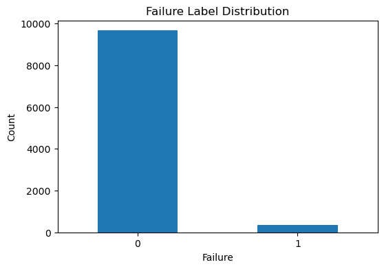
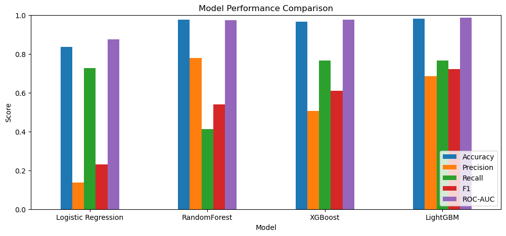
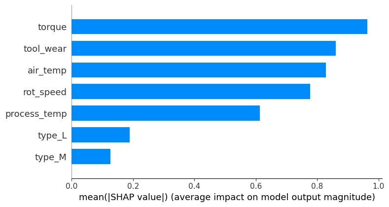
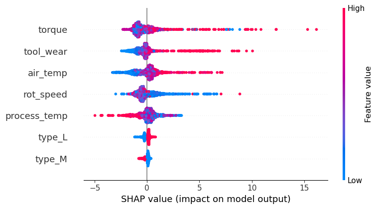
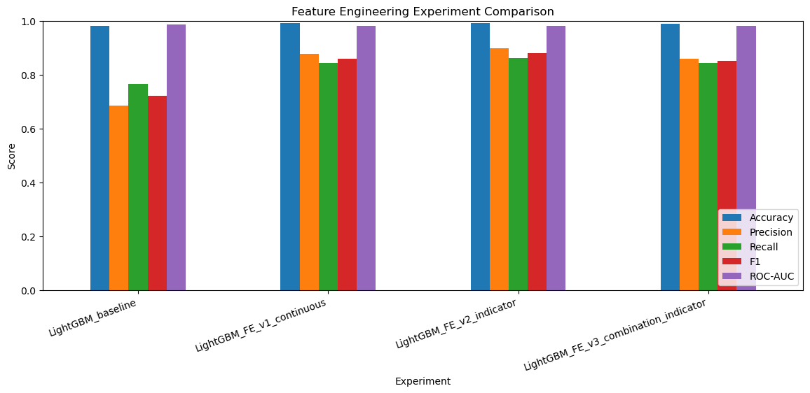
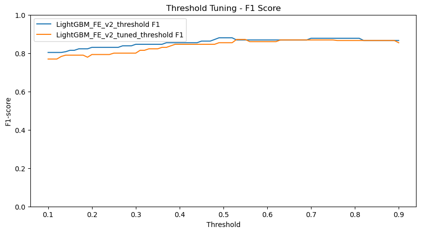
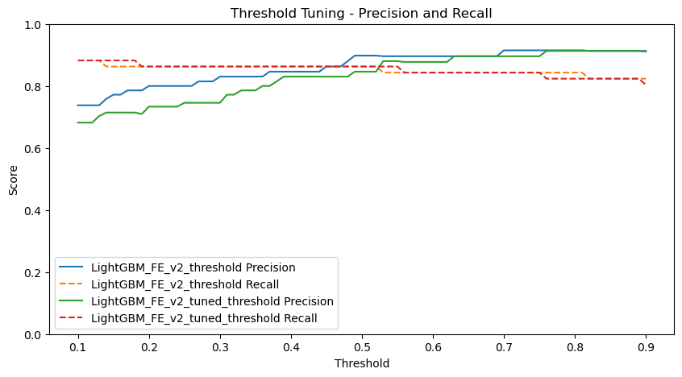
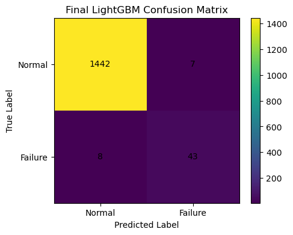

# Manufacturing Machine Learning Project

## 1. 프로젝트 개요

이 프로젝트는 제조 설비 데이터를 기반으로 정상/고장 여부를 예측하는 머신러닝 이진분류 프로젝트입니다.

Phase 1에서는 동일한 데이터셋을 활용하여 EDA를 수행하였고, Phase 2에서는 EDA 결과를 바탕으로 머신러닝 모델링, SHAP 분석, Feature Engineering, 하이퍼파라미터 튜닝, Threshold 조정, 최종 Test 평가까지 수행하였습니다.

* Phase 1 EDA Repository: https://github.com/mjbaa/manufacturing-eda-project

본 프로젝트의 최종 목표는 제조 설비 센서 데이터를 활용하여 고장 여부를 예측하고, 고장 예측에 영향을 주는 주요 feature를 분석하는 것입니다.

---

## 2. 사용 데이터

* Dataset: AI4I 2020 Predictive Maintenance Dataset
* Task: Binary Classification
* Target: `Machine failure`

Target 값의 의미는 다음과 같습니다.

|  값 | 의미 |
| -: | -- |
|  0 | 정상 |
|  1 | 고장 |

주요 feature는 다음과 같습니다.

| Feature        | 설명       |
| -------------- | -------- |
| `type`         | 제품 유형    |
| `air_temp`     | 공기 온도    |
| `process_temp` | 공정 온도    |
| `rot_speed`    | 회전 속도    |
| `torque`       | 토크       |
| `tool_wear`    | 공구 마모 시간 |

---

## 3. 프로젝트 구조

```text
manufacturing_macine_learning_project/
├── data/
├── notebooks/
│   └── quality_prediction_model.ipynb
├── models/
├── reports/
│   ├── experiment_results.csv
│   ├── experiment_comparison_from_baseline.csv
│   ├── experiment_comparison_from_previous.csv
│   ├── shap_importance_lightgbm.csv
│   ├── best_feature_columns_fe_v2.csv
│   ├── indicator_thresholds_fe_v2.csv
│   ├── tuning_improvement_from_fe_v2.csv
│   ├── threshold_tuning_results.csv
│   ├── threshold_improvement_from_fe_v2.csv
│   ├── final_model_test_result_fe_v2.csv
│   ├── final_model_valid_test_comparison.csv
│   ├── final_feature_columns.csv
│   ├── final_indicator_thresholds.csv
│   └── final_model_metadata.json
├── figures/
│   ├── failure_label_distribution.png
│   ├── all_model_performance_comparison.png
│   ├── shap_bar_lightgbm.png
│   ├── shap_summary_lightgbm.png
│   ├── feature_engineering_experiment_comparison.png
│   ├── threshold_tuning_f1_comparison.png
│   ├── threshold_tuning_precision_recall_comparison.png
│   └── confusion_matrix_final_lightgbm_fe_v2.png
├── README.md
└── .gitignore
```

`data/` 폴더의 원본 데이터 파일과 `models/` 폴더의 `.pkl` 모델 파일은 `.gitignore` 설정에 따라 GitHub에는 업로드하지 않습니다.

---

## 4. 전체 진행 과정

프로젝트는 다음 순서로 진행하였습니다.

1. 데이터 불러오기
2. 데이터 구조 확인
3. 컬럼명 정리
4. 이진분류 문제 정의
5. Feature / Target 분리
6. Train / Validation / Test Split
7. 평가 함수 생성
8. 기본 모델 학습 및 비교
9. 최종 후보 모델 선정
10. Feature Importance 분석
11. SHAP 분석
12. EDA + SHAP 기반 Feature Engineering
13. Feature Engineering 실험 결과 비교
14. LightGBM Hyperparameter Tuning
15. Threshold 조정
16. 최종 모델 Test 평가
17. 최종 모델 저장
18. 최종 결론 작성

---

## 5. 데이터 전처리

모델 학습 전 다음 전처리를 수행하였습니다.

* 컬럼명을 snake_case 형태로 정리
* 식별자 컬럼 제거

  * `udi`
  * `product_id`
* 데이터 누수 방지를 위한 라벨성 컬럼 제거

  * `TWF`
  * `HDF`
  * `PWF`
  * `OSF`
  * `RNF`
* Target 컬럼 `failure` 분리
* 범주형 변수 `type`에 One-Hot Encoding 적용
* train / validation / test 데이터 분리
* 클래스 비율 유지를 위해 `stratify` 적용

`TWF`, `HDF`, `PWF`, `OSF`, `RNF`는 고장 유형을 나타내는 라벨성 컬럼입니다.
이 컬럼들을 `failure` 예측 모델의 feature로 사용할 경우 데이터 누수가 발생할 수 있으므로 제거하였습니다.

---

## 6. 기본 모델 비교

먼저 기본 전처리 데이터 기준으로 다음 네 개의 모델을 학습하고 validation 데이터에서 성능을 비교하였습니다.

| Model               | Accuracy | Precision | Recall | F1-score | ROC-AUC |
| ------------------- | -------: | --------: | -----: | -------: | ------: |
| Logistic Regression |    0.835 |     0.137 |  0.725 |    0.230 |   0.875 |
| RandomForest        |    0.976 |     0.778 |  0.412 |    0.538 |   0.973 |
| XGBoost             |    0.967 |     0.506 |  0.765 |    0.609 |   0.977 |
| LightGBM            |    0.980 |     0.684 |  0.765 |    0.722 |   0.987 |

Logistic Regression은 Recall은 비교적 높았지만 Precision이 매우 낮았습니다.

RandomForest는 Precision은 높았지만 Recall이 낮아 실제 고장을 놓치는 경우가 많았습니다.

XGBoost는 RandomForest보다 Recall과 F1-score가 개선되었지만 Precision이 상대적으로 낮았습니다.

LightGBM은 F1-score와 ROC-AUC 기준으로 가장 좋은 성능을 보여 이후 개선 실험의 기준 모델로 선택하였습니다.

---

## 7. SHAP 분석

LightGBM 모델의 예측 결과를 해석하기 위해 SHAP 분석을 수행하였습니다.

SHAP 중요도 결과는 다음과 같습니다.

| Feature        | mean_abs_shap |
| -------------- | ------------: |
| `torque`       |      0.963609 |
| `tool_wear`    |      0.859954 |
| `air_temp`     |      0.827730 |
| `rot_speed`    |      0.777309 |
| `process_temp` |      0.613236 |
| `type_L`       |      0.188117 |
| `type_M`       |      0.125819 |

SHAP Summary Plot을 통해 다음 경향을 확인하였습니다.

* 높은 `torque`는 고장 예측을 증가시키는 방향으로 작용
* 높은 `tool_wear`는 고장 예측을 증가시키는 방향으로 작용
* 높은 `air_temp`는 고장 예측을 증가시키는 방향으로 작용
* 낮은 `rot_speed`는 고장 예측을 증가시키는 방향으로 작용
* `process_temp`는 `air_temp`와 함께 해석할 필요가 있음
* 제품 유형 feature인 `type_L`, `type_M`의 영향은 상대적으로 작음

이 결과는 Phase 1 EDA에서 확인한 패턴과 연결되며, 이후 Feature Engineering의 근거로 활용하였습니다.

---

## 8. Feature Engineering

EDA와 SHAP 분석 결과를 바탕으로 Feature Engineering을 단계적으로 수행하였습니다.

각 실험은 다음과 같습니다.

| Experiment                             | 설명                                  |
| -------------------------------------- | ----------------------------------- |
| `LightGBM_baseline`                    | 기존 feature만 사용한 LightGBM            |
| `LightGBM_FE_v1_continuous`            | 연속형 조합 feature 추가                   |
| `LightGBM_FE_v2_indicator`             | v1 feature에 구간 indicator feature 추가 |
| `LightGBM_FE_v3_combination_indicator` | v2 feature에 조합 indicator feature 추가 |

### 8.1 Feature Engineering v1

v1에서는 다음 연속형 조합 feature를 추가하였습니다.

| Feature              | 생성 기준             |
| -------------------- | ----------------- |
| `temp_diff`          | 공정 온도와 공기 온도의 차이  |
| `torque_speed_ratio` | 회전 속도 대비 토크 수준    |
| `wear_torque`        | 공구 마모 시간과 토크의 조합  |
| `wear_speed_ratio`   | 회전 속도 대비 공구 마모 정도 |
| `power_proxy`        | 토크와 회전 속도의 곱      |
| `air_temp_torque`    | 공기 온도와 토크의 조합     |

### 8.2 Feature Engineering v2

v2에서는 v1 feature set에 다음 구간 indicator feature를 추가하였습니다.

| Feature          | 설명                       |
| ---------------- | ------------------------ |
| `high_torque`    | train 기준 torque 상위 구간    |
| `high_tool_wear` | train 기준 tool_wear 상위 구간 |
| `high_air_temp`  | train 기준 air_temp 상위 구간  |
| `low_rot_speed`  | train 기준 rot_speed 하위 구간 |

구간 기준은 validation/test 데이터의 정보가 섞이지 않도록 train 데이터 기준 분위수를 사용하였습니다.

### 8.3 Feature Engineering v3

v3에서는 v2 feature set에 조합 indicator feature를 추가하였습니다.

| Feature                 | 설명                    |
| ----------------------- | --------------------- |
| `low_speed_high_torque` | 낮은 회전 속도와 높은 토크 조합    |
| `high_wear_high_torque` | 높은 공구 마모와 높은 토크 조합    |
| `high_air_high_torque`  | 높은 공기 온도와 높은 토크 조합    |
| `high_wear_low_speed`   | 높은 공구 마모와 낮은 회전 속도 조합 |

---

## 9. Feature Engineering 실험 결과

Feature Engineering 실험 결과는 다음과 같습니다.

| Experiment                           | Accuracy | Precision | Recall | F1-score | ROC-AUC |
| ------------------------------------ | -------: | --------: | -----: | -------: | ------: |
| LightGBM_baseline                    |    0.980 |     0.684 |  0.765 |    0.722 |   0.987 |
| LightGBM_FE_v1_continuous            |    0.991 |     0.878 |  0.843 |    0.860 |   0.982 |
| LightGBM_FE_v2_indicator             |    0.992 |     0.898 |  0.863 |    0.880 |   0.982 |
| LightGBM_FE_v3_combination_indicator |    0.990 |     0.860 |  0.843 |    0.851 |   0.982 |

v1에서는 연속형 조합 feature를 추가한 결과 F1-score가 0.722에서 0.860으로 크게 상승하였습니다.

v2에서는 구간 indicator feature를 추가한 결과 F1-score가 0.860에서 0.880으로 추가 개선되었습니다.

v3에서는 조합 indicator feature를 추가했지만 v2 대비 성능이 하락하였습니다.

따라서 최종 feature set은 validation 기준 F1-score가 가장 높은 FE_v2 feature set으로 선택하였습니다.

---

## 10. Hyperparameter Tuning

FE_v2 feature set을 기준으로 LightGBM 하이퍼파라미터 튜닝을 수행하였습니다.

튜닝에는 `RandomizedSearchCV`를 사용하였고, train 데이터 내부에서 Stratified Cross Validation을 수행하였습니다.

튜닝 결과는 다음과 같습니다.

| Metric    | FE_v2 | FE_v2_tuned | Diff_from_FE_v2 |
| --------- | ----: | ----------: | --------------: |
| Accuracy  | 0.992 |       0.990 |          -0.002 |
| Precision | 0.898 |       0.846 |          -0.052 |
| Recall    | 0.863 |       0.863 |           0.000 |
| F1-score  | 0.880 |       0.854 |          -0.026 |
| ROC-AUC   | 0.982 |       0.988 |          +0.006 |

튜닝 모델은 ROC-AUC는 개선되었지만, 기본 threshold 0.5 기준 Accuracy, Precision, F1-score가 하락하였습니다.

따라서 기본 threshold 기준으로는 튜닝 모델보다 FE_v2 feature set을 사용한 기본 LightGBM 모델이 더 적절하다고 판단하였습니다.

---

## 11. Threshold 조정

FE_v2 feature set을 사용한 기본 LightGBM 모델과 tuned LightGBM 모델을 대상으로 threshold 조정을 수행하였습니다.

Threshold를 0.10부터 0.90까지 변화시키며 validation 데이터 기준 F1-score가 가장 높은 조합을 탐색하였습니다.

Threshold 조정 결과, 가장 높은 F1-score를 보인 조합은 FE_v2 feature set을 사용한 기본 LightGBM 모델이었으며, best threshold는 약 0.52로 나타났습니다.

하지만 threshold를 0.5에서 0.52로 조정해도 실제 예측 결과는 달라지지 않았습니다.

최종적으로 threshold는 기본값인 0.5를 유지하였습니다.

---

## 12. 최종 모델

최종 모델 구성은 다음과 같습니다.

| 항목             | 값                 |
| -------------- | ----------------- |
| 모델             | LightGBM          |
| Feature set    | FE_v2 feature set |
| Hyperparameter | 기본 설정             |
| Threshold      | 0.5               |

---

## 13. 최종 Test 평가

최종 모델을 test 데이터에서 평가한 결과는 다음과 같습니다.

| Metric    | Value |
| --------- | ----: |
| Accuracy  | 0.990 |
| Precision | 0.860 |
| Recall    | 0.843 |
| F1-score  | 0.851 |
| ROC-AUC   | 0.989 |

Confusion Matrix는 다음과 같습니다.

| 실제 / 예측 | 정상 예측 | 고장 예측 |
| ------- | ----: | ----: |
| 실제 정상   |  1442 |     7 |
| 실제 고장   |     8 |    43 |

최종 모델은 실제 정상 1449개 중 1442개를 정상으로 정확히 예측하였고, 7개는 고장으로 잘못 예측하였습니다.

실제 고장 51개 중 43개를 고장으로 탐지하였고, 8개는 정상으로 잘못 예측하였습니다.

즉, test 데이터 기준 실제 고장의 약 84.3%를 탐지하였으며, 고장이라고 예측한 경우 실제 고장일 비율은 86.0%로 나타났습니다.

---

## 14. Validation-Test 성능 비교

최종 모델의 validation 성능과 test 성능을 비교한 결과는 다음과 같습니다.

| Metric    | Validation |  Test | Test - Validation |
| --------- | ---------: | ----: | ----------------: |
| Accuracy  |      0.992 | 0.990 |            -0.002 |
| Precision |      0.898 | 0.860 |            -0.038 |
| Recall    |      0.863 | 0.843 |            -0.020 |
| F1-score  |      0.880 | 0.851 |            -0.029 |
| ROC-AUC   |      0.982 | 0.989 |            +0.007 |

test 데이터에서는 validation 데이터보다 Accuracy, Precision, Recall, F1-score가 소폭 하락하였습니다.

하지만 하락 폭이 크지 않고 ROC-AUC는 오히려 상승하였습니다.

따라서 최종 모델이 validation 데이터에만 과도하게 맞춰졌다고 보기는 어렵고, test 데이터에서도 비교적 안정적인 일반화 성능을 보였다고 판단하였습니다.

---

## 15. 주요 시각화 결과

### Target 분포



### 기본 모델 성능 비교



### SHAP Bar Plot



### SHAP Summary Plot



### Feature Engineering 실험 비교



### Threshold Tuning F1 비교



### Threshold Tuning Precision / Recall 비교



### 최종 모델 Confusion Matrix



---

## 16. 모델 저장

최종 모델과 관련 산출물을 저장하였습니다.

| 산출물                                         | 설명                                    | GitHub 업로드 여부 |
| ------------------------------------------- | ------------------------------------- | ------------- |
| `models/final_lightgbm_fe_v2_model.pkl`     | 최종 LightGBM 모델 파일                     | No            |
| `reports/final_feature_columns.csv`         | 최종 모델 학습에 사용된 feature 컬럼 목록           | Yes           |
| `reports/final_indicator_thresholds.csv`    | indicator feature 생성에 사용한 threshold 값 | Yes           |
| `reports/final_model_metadata.json`         | 최종 모델 구성 및 test 성능 메타데이터              | Yes           |
| `reports/final_model_test_result_fe_v2.csv` | 최종 test 성능 결과                         | Yes           |

모델 파일인 `.pkl` 파일은 `.gitignore` 설정에 따라 GitHub에는 업로드하지 않습니다.

대신 모델 학습, Feature Engineering, 모델 저장 코드를 노트북에 포함하여 재현 가능하도록 구성하였습니다.

---

## 17. 실행 환경

주요 사용 라이브러리는 다음과 같습니다.

* Python
* pandas
* numpy
* matplotlib
* scikit-learn
* xgboost
* lightgbm
* shap
* joblib
* Jupyter Notebook

---

## 18. 실행 방법

1. 프로젝트를 클론합니다.

```bash
git clone <repository-url>
cd manufacturing_macine_learning_project
```

2. 필요한 패키지를 설치합니다.

```bash
pip install pandas numpy matplotlib scikit-learn xgboost lightgbm shap joblib jupyter
```

3. `data/` 폴더에 AI4I 데이터 파일을 저장합니다.

```text
data/ai4i2020.csv
```

4. Jupyter Notebook을 실행합니다.

```bash
jupyter notebook notebooks/quality_prediction_model.ipynb
```

---

## 19. 한계점

본 프로젝트의 한계점은 다음과 같습니다.

1. 고장 데이터가 정상 데이터에 비해 매우 적은 불균형 데이터입니다.
2. 최종 모델은 test 데이터에서 실제 고장 51개 중 43개를 탐지하였지만, 8개의 고장은 정상으로 잘못 예측하였습니다.
3. Feature Engineering은 EDA와 SHAP 분석을 근거로 설계하였지만, 실제 제조 현장의 물리적 원인까지 완전히 설명하는 것은 아닙니다.
4. SHAP 분석은 모델 해석에 도움을 주지만, 인과관계를 직접 증명하는 것은 아닙니다.
5. 본 프로젝트에서는 정적 tabular 데이터만 사용하였으며, 실제 제조 현장에서 중요한 시계열 센서 흐름은 반영하지 못하였습니다.

---

## 20. 개선 방향

향후 개선 방향은 다음과 같습니다.

1. Recall을 더 높이기 위한 비용 민감 학습 추가 실험
2. Oversampling, undersampling, SMOTE 등 불균형 데이터 처리 기법 실험
3. False Negative로 분류된 고장 샘플에 대한 SHAP 분석
4. 실제 제조 센서 데이터를 고려한 시계열 feature 추가
5. 모델 배포를 위한 전처리 및 Feature Engineering 파이프라인 구성
6. 저장된 feature 컬럼 목록과 threshold 값을 기반으로 재현 가능한 추론 코드 작성

---

## 21. 종합 결론

본 프로젝트에서는 제조 설비 데이터를 기반으로 정상/고장 여부를 예측하는 이진분류 모델을 구축하였습니다.

기본 모델 비교 결과, Logistic Regression, RandomForest, XGBoost, LightGBM 중 LightGBM이 validation 기준 F1-score와 ROC-AUC에서 가장 좋은 성능을 보였습니다.

이후 SHAP 분석과 Phase 1 EDA 결과를 바탕으로 Feature Engineering을 수행하였습니다.

연속형 조합 feature를 추가한 v1에서 성능이 크게 개선되었고, 구간 indicator feature를 추가한 v2에서 추가 개선이 나타났습니다.

조합 indicator feature를 추가한 v3는 오히려 성능이 하락하여 최종 feature set에서는 제외하였습니다.

하이퍼파라미터 튜닝은 ROC-AUC를 개선했지만 F1-score를 낮추었고, threshold 조정도 추가적인 성능 개선을 제공하지 못하였습니다.

최종적으로 FE_v2 feature set으로 학습한 기본 LightGBM 모델을 최종 모델로 선택하였습니다.

최종 모델은 test 데이터에서 Accuracy 0.990, Precision 0.860, Recall 0.843, F1-score 0.851, ROC-AUC 0.989를 기록하였습니다.

이를 통해 제조 설비 고장 예측 문제에서 EDA와 SHAP 분석을 바탕으로 한 Feature Engineering이 모델 성능 개선에 효과적임을 확인하였습니다.
